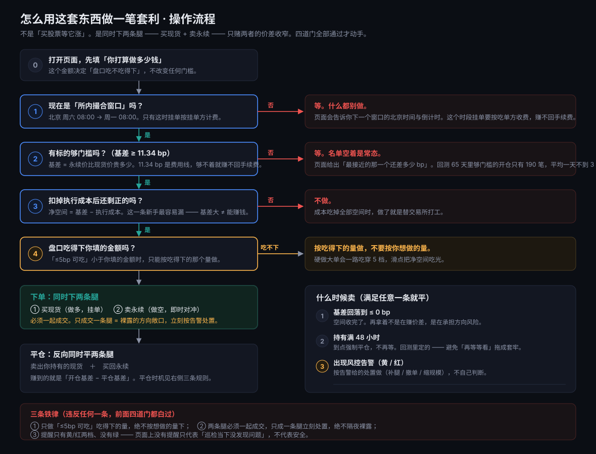

# 53 · 实战使用手册：怎么真的用这套系统做一笔套利

> 面向"我想真的照着操作"的人。配套流程图：`docs/flow-trade-decision.svg` / `.png`
> 本文只讲**怎么用**；判据为什么这么定，见 `docs/14`（成本口径）、`docs/15`（route）、`docs/52`（三问视图）。

---

## 0. 先纠正三个误解（不纠正这三条，后面全白看）

| ❌ 误解 | ✅ 实际 |
|---|---|
| "买入 = 买 TSLA 等它涨" | **不是**。是**同时下两条腿**：买 rToken 现货 ＋ 卖美股永续。方向相反，涨跌互相抵消 —— **不赌涨跌，只赌两者的价差收窄** |
| "基差大就能赚" | **不是**。门槛 11.34 bp 只是**费用线**。真正决定赚不赚的是**基差 − 实际执行成本**。实测中 HOOD 基差 50+ bp、净 +46 bp，而 META 基差 13 bp、净只剩 +2.9 bp —— 只看门槛会把两者当成一回事 |
| "填的金额越大赚得越多" | **不是**。金额**不改变任何门槛**。它决定的是**盘口吃不吃得下** —— 吃得下 $154 的标的，你填 $5,000 也做不进去 |

---

## 1. 你需要什么（前提条件）

| 项 | 要求 | 为什么 |
|---|---|---|
| 两个场所的账户 | 能买 rToken 现货（如 `RTSLAUSDT`）＋ 能开美股永续（如 `TSLAUSDT`） | 两条腿要**同时**下 |
| 资金 | 两条腿各一份（总占用 ≈ 2 × 单腿名义额） | 对冲需要两边都有保证金/头寸 |
| 时段 | **必须是「所内撮合窗口」**：北京时间 周六 08:00 → 周一 08:00 | 只有这时挂单按**挂单方**计费；其它时段挂单按吃单方收费，赚不回手续费 |
| 一件事先想清楚 | 你能接受**只成交一条腿** | 那是裸露的方向敞口，必须立刻按告警处置 |

> ⚠️ **散户做不了 mint/redeem**（rToken 的铸造赎回），所以这不是"无风险套利"。
> 本项目定位是**做市型价差捕获**：赚点差 + 基差收敛，承担逆向选择与腿风险。

---

## 2. 操作流程



**六步，一步都别跳：**

| # | 动作 | 在哪里看 |
|---|---|---|
| 1 | 打开页面 → 默认视图「① 怎么做」，**先填你打算做多少钱** | 顶部「按 $ ___ 测算」输入框 |
| 2 | 看第 ① 张卡**四道判据**是不是全打勾 | 「现在能买吗」卡 |
| 3 | 全打勾 → **直接看候选行右侧的「建议做 $X」** | 候选行 |
| 4 | **就按那个 $X 同时下两条腿**：买现货 ＋ 卖永续 | 你的交易所界面 |
| 5 | 成交后盯**三条平仓规则** | 第 ② 张卡「什么时候卖」 |
| 6 | 满足任意一条 → **反向同时平掉两条腿** | — |

**「建议做 $X」是怎么来的（不是拍脑袋）：**

```
建议做 = min(你填的金额, ≤5bp 可吃 × 25%)
```

- **≤5bp 可吃** ＝ 价格不动、滑点在 5bp 以内时，这个标的实际能被吃掉多少美元；
- **× 25%** ＝ 项目自己的规模上限约定（`project2/agent_team.py` 的 `DEPTH_TAKE_RATIO`），
  只吃盘口的一小部分，**避免自己把滑点吃上去**；
- **取 min** ＝ 两边都是硬约束，谁小听谁的：盘口更紧就听盘口的，你只想做小就听你的。

实测：HOOD 可吃 $766 → **建议做 $192**；GOOGL 可吃 $10,779 → **建议做 $2,695**；
TSLA 可吃 $138 → **建议做 $34**。**填 $200 和填 $50,000 得到的是同一个建议 $192** ——
因为约束在盘口，不在你。

**第 4 步的两个要点（最容易出事的地方）：**

- **必须一起成交**。只成交一条腿 = 裸露的方向敞口，页面右下角会出**红色**告警，按它给的处置做（立刻补另一条腿 / 或平掉已成交的那条）。
- **按吃得下的量下，不要按你想做的量下**。硬做大单会一路吃穿 5 档，滑点把净空间吃光。

---

## 3. 拿真实数据走一遍（2026-09-21 00:43 北京，`in_house` 窗口内）

**四道判据（全部打勾才叫能做）：**

| # | 判据 | 当时实测 |
|---|---|---|
| 1 | 处于所内撮合窗口 | ✅ `route = in_house` |
| 2 | 有标的的两条腿盘口齐全 | ✅ 9/10 齐全（SOXL 缺一条腿，不影响别人） |
| 3 | 基差 ≥ 11.34 bp | ✅ 有 4 个标的达标 |
| 4 | 扣掉执行成本后还有空间 | ✅ 每个候选的净空间都是正的 |

**候选 —— 页面直接给「建议做多少」：**

| 标的 | 净空间 | ≤5bp 可吃 | **建议做** | 引擎结论 |
|---|---|---|---|---|
| HOOD | +52.71 bp | $766 | **$191** | 谨慎 |
| GOOGL | +23.06 bp | $5,478 | **$1,369** | 谨慎 |
| TSLA | +13.36 bp | $137 | **$34** | 谨慎 |
| META | +1.76 bp | $154 | **$38** | 谨慎 |

**这张表怎么读（三步）：**

1. **先看「建议做」那一列** —— 那就是这一单该下的规模。**不用自己从"可吃多少"倒推**。
2. **它怎么算的**：`min(你填的金额, ≤5bp 可吃 × 25%)`。HOOD 的 $766 × 25% = $191；
   GOOGL 的 $5,478 × 25% = $1,369；TSLA 只能做 **$34**。
3. **净空间那一列几乎不随金额变** —— 这是正常的：策略是挂单做市，
   每单位成本由费率、半幅点差、逆向漂移、成交概率决定，**与单笔规模无关**。
   变的是**你能做多大**，不是**每单位赚多少**。

> **结论式的读法**：不是"哪个基差大做哪个"，而是
> **"每个标的按它自己的建议规模做，或者干脆不做"**。
> TSLA 净空间 +13.36 bp 看着不错，但**只能做 $34** —— 这个规模下手续费占比会很难看，
> 实际值不值得动手要你自己判断（页面不下单、也不替你决定）。
>
> 四个候选的引擎结论都是「谨慎」：引擎拿不到基差，只要成本为正它就一律给谨慎
> （`docs/52` §4.2）。它的意思是**缩小规模、放宽价位再挂**，不是"不能做"。

---

## 4. 测算金额（页面上那个输入框）

**它影响什么：**

- ✅ **建议做多少** —— 决定这一单的规模建议（`min(你填的, ≤5bp 可吃 × 25%)`）
- ✅ 测算规模本身

**它不影响什么（重要）：**

- ❌ **不改任何门槛**。11.34 bp 来自回测 `main_cfg`，与金额无关 —— 填大一点**不会**让不够门槛的标的变成达标
- ❌ **不改「扣掉执行成本后还剩多少」那一行**（原因见下）
- ❌ **不会把建议规模抬高到超过盘口**。填 $50,000 时，盘口只有 $766 的标的照样只建议做 $191

**回落规则（页面会照实告诉你）：**

| 你填的 | 结果 |
|---|---|
| 空 / 无法解析 | 按默认 $5,000 算，并提示原因 |
| < $10 或 > $1,000,000 | 按默认 $5,000 算，并提示原因 |
| $10 ~ $1,000,000 之间 | 采纳 |

> **已知边界（如实写在页面上）**：两腿成本模型里的「双腿全吃单」那一行**没有计入 5 档冲击**
> （同一个文件的单腿路径是计入的），所以金额变大时**那一行会偏乐观**。策略实际选的是
> 「双腿全挂单」，不受此影响。详见 §7 与 `docs/52` §4.2。

---

## 5. 三条铁律（违反任何一条，前面四道门都白过）

1. **只做「≤5bp 可吃」吃得下的量**，绝不按想做的量下。
2. **两条腿必须一起成交**。只成一条腿立刻处置，**绝不隔夜裸露**。
3. **提醒只有黄/红两档、没有绿** —— 页面上没有提醒，只代表"巡检当下没发现问题"，**不代表安全**。

---

## 6. 什么时候必须停手

| 触发 | 动作 |
|---|---|
| 第 ① 张卡有**任何一条判据打叉** | 停手。页面会直接告诉你**卡在哪一条、差多少** |
| 候选的「≤5bp 可吃」< 你想做的量 | 要么把量降到吃得下的水平，要么换标的，**不要硬做** |
| 出现**红色**告警（如只成交一条腿） | **立刻**按告警给的处置做，不要等 |
| 出现**黄色**告警 | 缩小规模 / 放宽价位 / 撤单观望 |
| 页面显示"取不到实时盘口" | 停手。**没有数据时既不能说能买、也不能说不能买** —— 不要凭感觉动手 |
| 页面显示"巡检数据已过期" | 持仓类风险一栏不可用；别把它当成"没风险" |

---

## 7. 这套系统给你什么、不给你什么

**给：**

- 四道判据的**机械判定**：窗口 / 两腿盘口 / 基差门槛 / 扣掉成本后的净空间
- 每个数字的**出处**（门槛来自回测参数，成本来自实测盘口与成交，页面不自己算）
- **为什么不能做**的可核验理由（卡在哪一条、差多少 bp）
- 一条确定性的平仓规则（不是"看着办"）

**不给：**

- ❌ **不下单**。所有下单动作都要你自己在交易所做
- ❌ **不预测涨跌**。这套东西完全不赌方向
- ❌ **不是无风险套利**。rToken 的 mint/redeem 散户做不了
- ❌ **不保证成交**。挂单本来就可能不成交 —— 不成交是正常结果，不是故障
- ❌ 当前口径下**风险引擎最多只会给「谨慎」**（它拿不到基差，只看成本是否为正）。
  所以"引擎说谨慎"不等于"不能做"，真正判断赚不赚要看第 ④ 条净空间（`docs/52` §4.2）

---

## 8. 自己复跑验证

```powershell
python server/app.py --port 8787            # 起服务
python server/app.py --selftest             # 纯函数自检（金额回落 / 行情合并 / 下一窗口）
python tools\reproduce_check.py             # 全量自检，退出码 0 = 全通过
python tools\ui_check.py --url http://127.0.0.1:8787/   # 真浏览器验收（含金额输入的三项断言）
```

改金额时可以直接用接口看：

```powershell
curl "http://127.0.0.1:8787/api/signals?size_usd=200"     # 小金额
curl "http://127.0.0.1:8787/api/signals?size_usd=50000"   # 大金额
curl "http://127.0.0.1:8787/api/signals?size_usd=99999999" # 超上限 -> 回落并说明
```

---

## 9. 一句话

**这套系统的产出不是"买什么"，而是"现在能不能做、能做多大、什么时候必须出来"。**
金额填进去之后，页面回答的是最后一个问题里最关键的一半：**你打算做的这个量，盘口接不接得住。**
